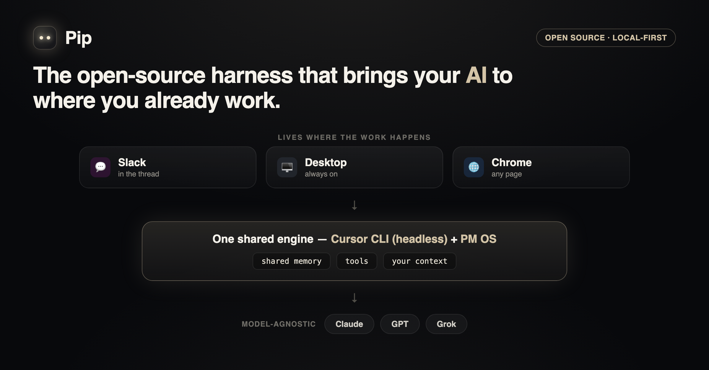

# Pip

**An ambient AI coworker that lives where you work.** **Pip** is one coworker who shows up
in Slack, on your screen, and in your browser. Pip starts with a blank memory and **builds your
context as you go**, or mounts a capability OS you own (like
[PM OS](https://github.com/hardiktiwari/PM-operating-OS)) if you have one. It's powered by the
**Cursor CLI**, so the same coworker runs on *any* model.

> One coworker. Many surfaces. Your models, your machine, your context — that compounds as you work.

**Website:** [hardiktiwari.github.io/tandem-site](https://hardiktiwari.github.io/tandem-site/) — product overview, surfaces, and quickstart.

---

## Demo

Pip is an **open-source harness that brings your AI to where you already work.** It takes the coding
agent you already trust (via the Cursor CLI), makes it headless, and drops it into Slack, your
desktop, and Chrome — one coworker, one shared memory, with the tools to actually ship. The clip
below shows a real Slack thread turning into a live roadmap, a meeting moved by voice, and work
handed off from any webpage.

<video src="https://hardiktiwari.github.io/tandem-site/pip-demo.mp4" poster="https://hardiktiwari.github.io/tandem-site/pip-demo-poster.png" controls muted playsinline width="100%"></video>

> ▶️ **[Watch the demo](https://hardiktiwari.github.io/tandem-site/pip-demo.mp4)** (if the player above doesn't load inline)

[](https://hardiktiwari.github.io/tandem-site/pip-demo.mp4)

---

## The idea

Most "AI in your tools" products are a model wrapped in a chat box, locked to one vendor and one
surface. Pip flips that:

1. **The brain is yours, and it compounds.** Pip works from day one with zero setup — it saves what
   it learns to a local `memory/` and reuses it on every surface, so context grows as you work. Bring
   a capability OS you own (like PM OS — PM skills, domain knowledge, memory) and Pip mounts it as a
   rich starting point, but nothing is required to begin.
2. **The engine is model-agnostic.** Every surface shells out to one shared adapter around
   `cursor-agent`. Switch from `gpt-5` to `sonnet-4` to `auto` with an env var — no new integration.
3. **The surfaces meet you where you already are.** A Slack teammate, a floating desktop task widget,
   and a browser extension all call the *same* engine against the *same* workspace.

```
┌──────────────────────────────────────────────────────────────────┐
│  SURFACES                                                          │
│   Pip · Slack          Pip · desktop           Pip · Chrome      │
│   tag @Pip             on-screen               page-aware Q&A     │
└─────────┬──────────────────────┬──────────────────────┬───────────┘
          │                      │                      │
          ▼                      ▼                      ▼
┌──────────────────────────────────────────────────────────────────┐
│  ENGINE  ·  packages/engine  ·  one adapter around the Cursor CLI  │
│  runAgent() → cursor-agent -p … --model <any> --workspace <repo>   │
└────────────────────────────────┬───────────────────────────────────┘
                                 ▼
┌──────────────────────────────────────────────────────────────────┐
│  BRAIN  ·  external/pm-operating-os (git submodule)                │
│  skills · knowledge · memory · MCP tools — loaded via AGENTS.md    │
└──────────────────────────────────────────────────────────────────┘
```

---

## The three surfaces — one coworker, Pip

| Surface | Name | What it does | Where |
|---|---|---|---|
| **Slack** | **Pip** (`@Pip`) | Tag or DM your team's coworker. Runs `cursor-agent` in the workspace, replies in-thread. | `apps/slack` |
| **Desktop** | **Pip** | Pip lives on your screen. Click to ask; **⌘⇧T** to snip and get an answer. | `apps/pip` |
| **Browser** | **Pip** | Page-aware prompts about whatever tab you're on, via a local bridge to the engine. | `apps/chrome-extension` |

All three import `@tandem/engine`. One coworker (**Pip**) in three places, one brain (**PM OS**).

---

## Quickstart

### One-command install

```bash
curl -fsSL https://raw.githubusercontent.com/Sach1ng/tandem/main/install.sh | bash
```

That checks Node, grabs the code, builds it, puts the `tandem` command on your PATH, installs the
Cursor CLI if needed, and initializes your workspace. Then:

```bash
cursor-agent login     # one-time model auth
tandem pip             # launch Pip on your desktop
```

**No PM OS required.** Pip starts with a blank memory and **builds your context as you go** — as you
work, it saves durable facts to `~/.tandem/memory/` and reuses them on every surface. If you *do*
have a PM OS brain, `tandem init` picks it up automatically as a rich starting point.

**Prerequisites:** Node ≥ 20.6 and the Cursor CLI (the installer handles the Cursor CLI for you).

### Manual install (npm)

```bash
npm install -g @tandem/cli @tandem/pip @tandem/slack

tandem pip               # self-initializes ~/.tandem on first run, then launches
tandem doctor            # optional: verify Node + cursor-agent

# Slack (after the Pip OAuth app is configured — see apps/slack/README.md)
tandem slack connect     # one-click OAuth install into your workspace
tandem slack start       # run the coworker bot locally
```

Optional: use a custom workspace directory:

```bash
tandem init ~/my-tandem-workspace
export TANDEM_WORKSPACE=~/my-tandem-workspace
```

All surfaces respect `TANDEM_WORKSPACE` (alias: `CURSOR_WORKDIR`).

### Develop from source (contributors)

```bash
# 1. Clone with the PM OS submodule
git clone --recurse-submodules https://github.com/Sach1ng/tandem.git
cd tandem
# (already cloned? run: git submodule update --init --recursive)

# 2. Install & build
npm install
npm run build

# 3. Verify the engine + inspect the CLI's JSON shape
npm run engine:smoke
```

Then start a surface:

```bash
# Slack
cd apps/slack && cp .env.example .env   # fill tokens + ALLOWED_USERS
npm start

# Pip (macOS)
npm run pip

# Chrome extension: build it, run the bridge, load dist/ as an unpacked extension
npm run chrome:build
npm run bridge -w @tandem/chrome-extension
```

Per-surface setup lives in each app's README.

---

## Why the Cursor CLI (the "any model" bit)

The engine is a thin, well-tested wrapper around `cursor-agent`:

```ts
import { runAgent } from "@tandem/engine";

const { text, chatId } = await runAgent(
  { model: "auto", workspace: repoRoot },           // ← swap models freely
  { prompt, resumeChatId, outputFormat: "json" },   // ← chatId enables thread resume
);
```

Two deliberate design choices, both from hard-won experience:
- **No `--system-prompt`.** `cursor-agent` doesn't have one, so persona/charter is delivered via the
  prepended prompt *and* the auto-loaded `AGENTS.md` + `.cursor/rules`.
- **Tolerant result parsing.** The CLI's JSON shape isn't contractually stable, so `extractResult`
  reads it defensively across versions. `npm run engine:smoke` shows you exactly what your version emits.

---

## How Pip differs from a single-vendor Slack bot

|  | Single-vendor Slack AI | **Pip** |
|---|---|---|
| Models | One vendor's models | **Any** model the Cursor CLI supports |
| Surfaces | Slack only | **Slack + desktop + browser**, one shared engine |
| Brain / memory | Closed, hosted | **Yours, local, grows as you go** (optional PM OS you own) |
| Hosting | Vendor cloud | **Your machine**, local-first |
| Access | Enterprise-gated | **Open source**, works solo |

---

## Repo layout

```
packages/
  engine/   Cursor CLI adapter — runAgent, extractResult, resume, smoke test
  core/     shared utils — Slack mrkdwn, atomic JSON state, charter loader, workspace resolution
  cli/      `tandem` CLI — init, doctor, pip (npm-installable, no git required)
  pm-os/    PM OS brain bundle for `tandem init` (npm publish artifact)
apps/
  slack/             Bolt coworker (Socket Mode + polling fallback)
  pip/               Electron desktop coworker (tasks.md contract, parser, groom/capture)
  chrome-extension/  MV3 extension + local bridge server
external/
  pm-operating-os/   PM OS — the brain (git submodule for dev; bundled in @tandem/pm-os for install)
AGENTS.md            workspace charter, auto-loaded by the engine on every run
```

### Publishing to npm

From a clean checkout with submodules initialized:

```bash
npm run build
npm publish --workspace @tandem/core
npm publish --workspace @tandem/engine
npm publish --workspace @tandem/pm-os
npm publish --workspace @tandem/pip
npm publish --workspace @tandem/cli
```

---

## Security

`cursor-agent --force` lets the agent run shell on your machine — that's how it gets work done, and
it's remote code execution by design. So:
- **Always set `ALLOWED_USERS`** in the Slack app. Empty = anyone in the channel can run commands.
- The browser bridge binds to `127.0.0.1` only and refuses any request that isn't from the Pip
  extension: it enforces a loopback `Host` (anti DNS-rebind) and checks the browser-set, unforgeable
  `Origin`, so no web page can reach it (blocks both `cors` and `no-cors` POSTs). Its `/ask` endpoint
  runs in **read-only `ask` mode**; only the explicit **Assign to Pip** action (`/assign`) runs with
  full tool access. Request bodies are capped.
- The desktop monitor also binds to `127.0.0.1` only, is GET-only, and enforces a loopback `Host` check.
- `.env` and all runtime state (`sessions.json`, `processed.json`, `open-threads.json`) are gitignored.

---

## Status

All four surfaces are live-tested against a local `cursor-agent`:

```bash
npm run verify              # 16 offline checks
npm run engine:smoke        # CLI + JSON parse
npm run slack:smoke         # agent + Slack DM reply
npm run pip:agent-smoke  # groom + capture
npm run pip:screenshot-smoke  # vision (set TEST_IMG=… if no Screen Recording)
```

Slack setup wizard: `npm run slack:setup` → http://127.0.0.1:8766

Roadmap: ambient/proactive nudges, scheduled tasks, and more surfaces.

## Credits

Co-created by [Sachin Gupta (@Sach1ng)](https://github.com/Sach1ng) and
[Hardik Tiwari (@hardiktiwari)](https://github.com/hardiktiwari).

Stands on [PM OS](https://github.com/hardiktiwari/PM-operating-OS) and the
[Cursor CLI](https://cursor.com/docs/cli).

*Personal project. Not affiliated with or endorsed by any employer or vendor.*

## License

MIT — see [LICENSE](LICENSE).
